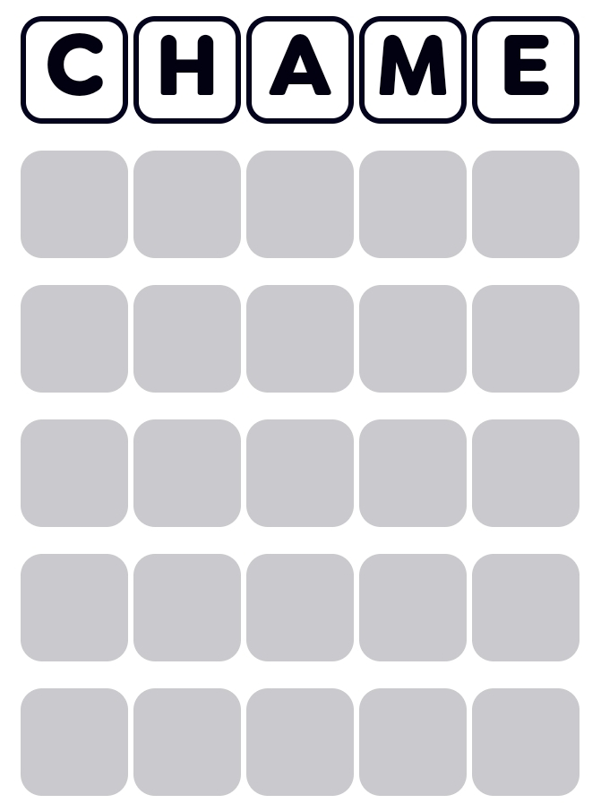
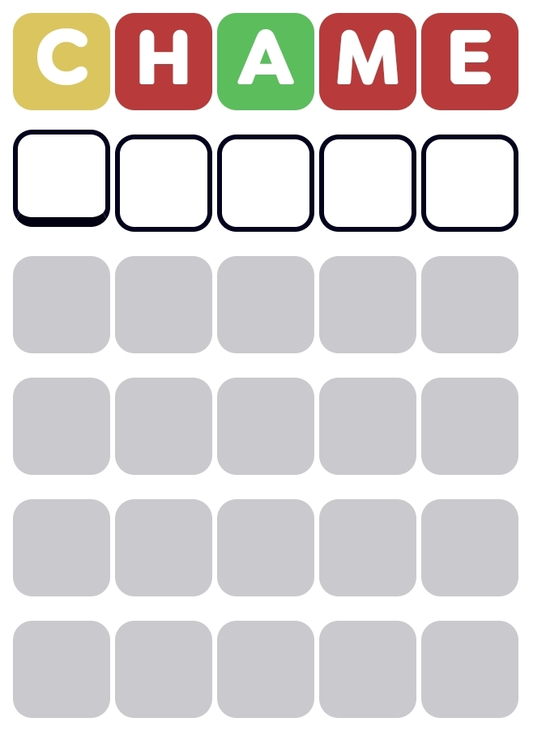
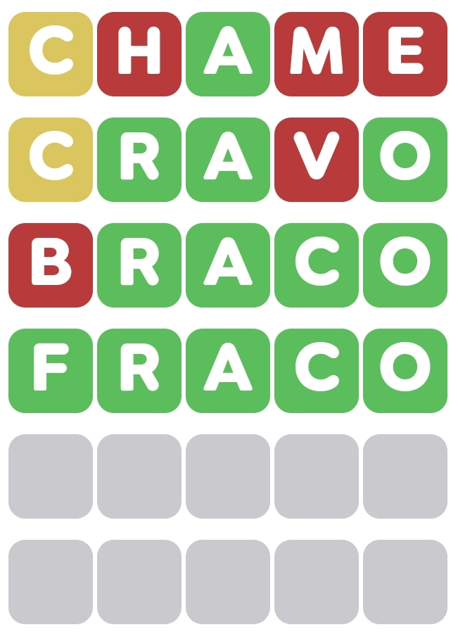
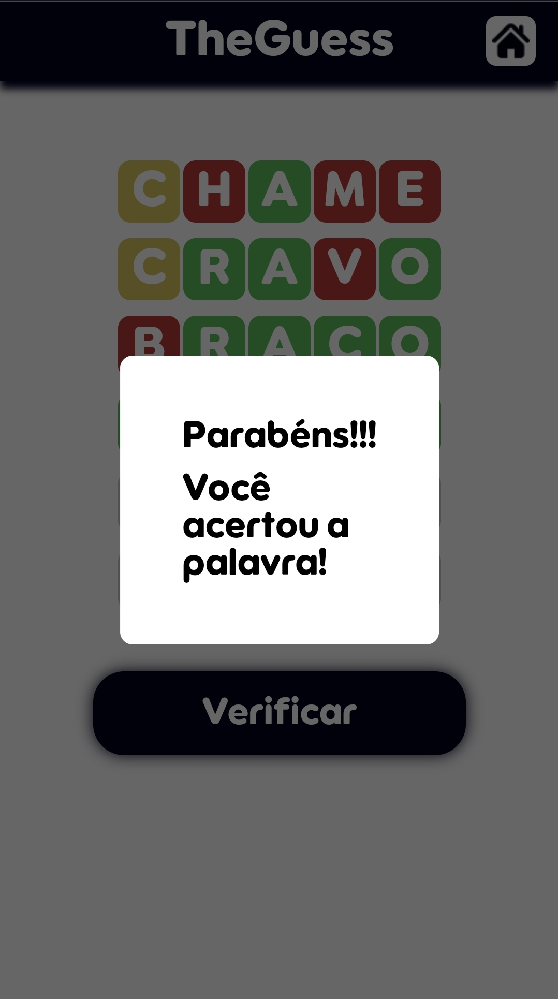

<h1 align="center"> 
  
</h1>

  

## 🚀 Em Desenvolvimento 🚀

## Descrição do Projeto

**TheGuess** é um jogo de adivinhação de palavras onde o usuário tem até 6 tentativas para adivinhar a palavra do dia. Após cada tentativa, as letras da palavra inserida serão coloridas conforme sua correção:

- **Verde:** A letra está na palavra e na posição correta.
- **Amarelo:** A letra está na palavra, mas em uma posição diferente.
- **Vermelho:** A letra não está presente na palavra.

A palavra muda diariamente, proporcionando um novo desafio a cada dia!

## Funcionalidades

- Adivinhar uma palavra em até 6 tentativas.
- Feedback visual de acerto (vermelho, amarelo e verde) para cada letra.
- Palavra nova a cada dia.
- Salvar dados no Session e Local Storage.
- Interface simples e intuitiva.

## Demonstração

  
  
  
  
  
  

Mantenha-se atualizado, pois estamos em constante desenvolvimento e novas funcionalidades estão a caminho!

Colaboradores:
[@dnlKaizer](https://github.com/dnlKaizer)
[@papalmeida](https://github.com/papalmeida)

Link do site:
[theguess.netlify.app](https://theguess.netlify.app/)
